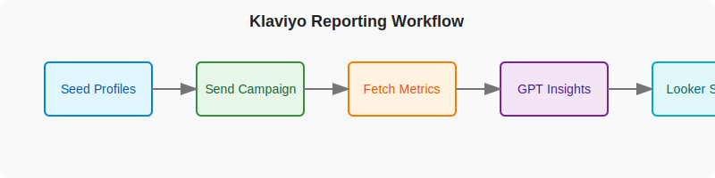
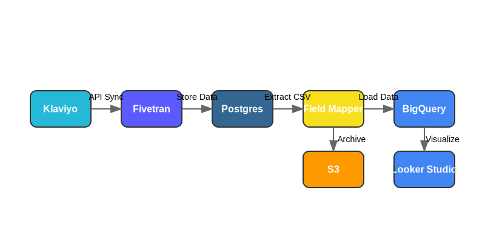

# Klaviyo Reporting POC

This repository contains tools for generating realistic mock data in Klaviyo to power reporting demos, test automations, and showcase value to clients. It also includes a narrow scope POC for automating Klaviyo report generation via Looker Studio.

## Workflow

### Original Workflow



### Fivetran + BigQuery Workflow



The data flows through the system as follows:

1. **Klaviyo → Fivetran**: Fivetran syncs Klaviyo data to a Postgres database
2. **Fivetran → Postgres**: Raw Klaviyo data is stored in Postgres tables
3. **Postgres → CSV**: Data is extracted from Postgres to CSV files
4. **CSV → Field Mapper**: CSV data is processed through the field mapper
5. **Field Mapper → S3**: Processed data is archived to S3 for long-term storage
6. **Field Mapper → BigQuery**: Processed data is loaded into BigQuery tables
7. **BigQuery → Looker Studio**: Looker Studio connects directly to BigQuery for visualization

## Features

- **Mock List Creation**: Creates a test list named `Mock_Reporting_List`
- **Mock Profile Generation**: Adds 20-30 realistic but fictional profiles to the list
- **Campaign Activity Simulation**: Simulates events for two mock campaigns
- **Flow Events Simulation**: Creates a mock welcome flow with message interactions
- **Purchase Behavior Simulation**: Generates realistic purchase events with product data
- **Automated Reporting**: Extracts campaign metrics from Klaviyo API and prepares them for Looker Studio
- **Fivetran Integration**: Syncs Klaviyo data to Postgres database (in development)
- **BigQuery Warehouse**: Stores processed data for analytics and reporting (in development)
- **S3 Archiving**: Archives processed data to S3 for long-term storage (in development)
- **Email Notifications**: Sends email notifications via AWS SES (in development)

## Requirements

- Python 3.6+
- Python version managed with `pyenv` (see `.python-version`; Python 3.10.6)
- Required packages: `requests`, `faker`, `python-dotenv`, `boto3`, `psycopg2-binary`, `responses` (see requirements.txt)
- Klaviyo API key (stored in private-api-key.txt or as environment variable)
- Looker Studio account (for visualization)
- For Fivetran + BigQuery integration:
  - Fivetran account with Klaviyo connector
  - Postgres database (Fivetran destination)
  - AWS account with S3 and SES access
  - BigQuery account (for data warehousing)

## API Version

- All scripts use Klaviyo API revision **2025-04-15**
- See [API Usage Guidelines](docs/api_usage.md) for important information about API versioning and edge cases
- TODO: Make API revision an environment variable to simplify future updates

## Installation

```bash
pip install -r requirements.txt
```

## Environment Variables

Copy `.env.example` to `.env` and update with your values:

```bash
# Klaviyo API Configuration
KLAVIYO_API_KEY=pk_xxx
AUDIENCE_ID=YdSN6t
CAMPAIGN_ID=AbCdEf
TEMPLATE_ID=WJ3kbV
NUM_TEST_PROFILES=5
MODE=mock  # Use 'real' for actual API calls

# Integration Configuration
SLACK_WEBHOOK_URL=https://hooks.slack.com/services/YOUR_WEBHOOK
LOOKER_REPORT_URL=https://datastudio.google.com/reporting/YOUR_REPORT_ID

# Fivetran Configuration
FIVETRAN_API_KEY=your_fivetran_api_key
FIVETRAN_API_SECRET=your_fivetran_api_secret
FIVETRAN_GROUP_ID=your_fivetran_group_id
FIVETRAN_CONNECTOR_ID=your_fivetran_connector_id

# Postgres Configuration
PG_HOST=your_postgres_host
PG_PORT=5432
PG_DB=your_postgres_db
PG_USER=your_postgres_user
PG_PASSWORD=your_postgres_password

# AWS Configuration
AWS_ACCESS_KEY_ID=your_aws_access_key
AWS_SECRET_ACCESS_KEY=your_aws_secret_key
AWS_REGION=us-east-1
S3_BUCKET=your_s3_bucket
S3_PREFIX=klaviyo-poc/
SES_FROM_EMAIL=your_verified_email@example.com
```

Alternatively, you can set these as environment variables in your system.

For a comprehensive guide on environment setup, including a checklist of required variables and setup instructions, see the [Environment Setup Guide](docs/setup.md).

Note: For the Fivetran + BigQuery integration, additional environment variables are required. See the [Fivetran + BigQuery Integration PR Plan](docs/FIVETRAN_BIGQUERY_PR_PLAN.md) for details.

## Mock Data Generation

### Usage

1. Set up your environment variables (either in `.env` file or system environment)
2. Run the script:

```bash
python mock_klaviyo_reporting_data.py
```

Alternatively, you can still use the legacy method:

1. Ensure your Klaviyo API key is in `private-api-key.txt` (should start with `pk_`)
2. Run the script as above

### Sending Reports to Slack

To send campaign performance reports to Slack:

```bash
python slack_integration.py
```

This will format the metrics and insights into a nicely formatted Slack message with links to the Looker Studio dashboard.

### What Gets Created

1. **List**: `Mock_Reporting_List` with 25 profiles
2. **Campaigns**:
   - `Mock_Welcome_Campaign`
   - `Mock_Product_Update`
3. **Flow**: `Mock_Welcome_Flow`
4. **Events**:
   - Campaign events: `Email Opened`, `Email Clicked`, `Unsubscribed`
   - Flow events: `Flow Email Sent`, `Flow Email Opened`
   - Purchase events: `Placed Order` with product details
5. **Integrations**:
   - Slack notifications with campaign performance metrics
   - Links to Looker Studio dashboards

## Narrow Scope POC

A narrowed scope POC has been implemented to focus specifically on automating Klaviyo report generation via Looker Studio using direct Klaviyo APIs. This implementation includes:

- **klaviyo_api_ingest.py**: Extracts campaign metrics from the Klaviyo API
- **lookml_field_mapper.py**: Normalizes Klaviyo fields to match Looker Studio schema
- **etl_runner.py**: Integrates the fetch → normalize → export pipeline
- **mock_looker_dataset.csv**: Mock dataset for testing visualizations
- **test_visualization_stub.json**: Sample Looker Studio configuration

For detailed information on the narrow scope POC, see [README-NARROW-SCOPE-POC.md](README-NARROW-SCOPE-POC.md).

### Running the Narrow Scope POC

```bash
# Run the full ETL pipeline
python src/etl_runner.py --output klaviyo_metrics.csv

# Or run individual components
python src/klaviyo_api_ingest.py --output campaigns.csv
python src/lookml_field_mapper.py
```

See the [Narrow Scope POC Documentation](README-NARROW-SCOPE-POC.md) for more details.

## Fivetran + BigQuery Integration

The project is being enhanced with a Fivetran + BigQuery integration to provide a more scalable and robust data pipeline. This implementation includes:

- **Fivetran Integration**: Reliable data integration from Klaviyo to a Postgres database
- **BigQuery Warehouse**: Scalable data warehouse for analytics and reporting
- **Looker Studio Connection**: Direct connection to BigQuery for visualization
- **S3 Archiving**: Long-term storage of processed data for audit and recovery

The new data flow is:

1. Klaviyo data is synced to Postgres via Fivetran
2. Data is extracted from Postgres to CSV
3. CSV data is processed through the field mapper
4. Processed data is loaded to BigQuery and archived to S3
5. Looker Studio connects directly to BigQuery for visualization

### Running the Fivetran + BigQuery Integration

```bash
# Run the full ETL pipeline with Fivetran source
python src/etl_runner.py --source fivetran --start 2024-05-01 --end 2024-05-07

# Upload processed data to S3
python src/etl_runner.py --source fivetran --start 2024-05-01 --end 2024-05-07 --upload-s3 s3://bucket/prefix/

# Load data into BigQuery
python src/bq_loader.py --file data/klaviyo_metrics_20250506_161741.csv --report-type campaign
```

### Running the End-to-End Demo

To run the complete end-to-end demo that showcases the entire data pipeline:

```bash
# Run the demo with default settings (last 30 days of data)
./scripts/run_end_to_end_demo.sh

# Run the demo for a specific date range
./scripts/run_end_to_end_demo.sh --start-date 2025-04-01 --end-date 2025-04-30

# Run in dry-run mode without making actual API calls
./scripts/run_end_to_end_demo.sh --dry-run

# Send email notification when complete
./scripts/run_end_to_end_demo.sh --notify-email recipient@example.com
```

For detailed information about the end-to-end demo, see the [End-to-End Demo Guide](docs/END_TO_END_DEMO.md).

### Looker Studio Integration

The Looker Studio integration provides interactive dashboards for visualizing Klaviyo campaign data. Key features include:

- **Direct BigQuery Connection**: Connect Looker Studio directly to BigQuery for real-time data access
- **Interactive Dashboards**: Create customizable dashboards with filters and controls
- **Automated Refresh**: Schedule automatic data refreshes to keep dashboards up-to-date
- **Shareable Reports**: Share reports with team members and clients

To set up the Looker Studio integration, follow the step-by-step guide in [Looker Studio + BigQuery Setup](docs/looker_bigquery_setup.md).

For detailed information on the Fivetran + BigQuery integration, see the [POC Overview](docs/POC_OVERVIEW.md) and the [Fivetran + BigQuery Integration PR Plan](docs/FIVETRAN_BIGQUERY_PR_PLAN.md).

## Notes

- All mock data is clearly marked with `Mock_` prefixes
- No real emails are sent during this process
- Events are distributed across profiles with randomized timestamps
- Purchase data includes realistic product names, quantities, and prices

## Troubleshooting

If you encounter API errors:

- Verify your API key is correct and has proper permissions
- Check that the key in private-api-key.txt doesn't have trailing whitespace
- The script includes rate limiting to avoid overwhelming the Klaviyo API
- If API calls are failing, check if the API revision (2025-04-15) is still supported

## Known Limitations

- The current implementation only supports basic campaign metrics (open rate, click rate)
- Limited error handling for API rate limits
- The Fivetran + BigQuery integration is still in development
- Requires Fivetran, Postgres, BigQuery, and AWS S3 accounts for full functionality

## Security

- The script reads the API key from a separate file for security
- No real customer data is used or modified
- No actual emails are sent to anyone

## Development

⚠️ **IMPORTANT: All developers must follow the Fivetran + BigQuery Integration PR Plan** ⚠️

This project follows a structured development process outlined in the
[Fivetran + BigQuery Integration PR Plan](docs/FIVETRAN_BIGQUERY_PR_PLAN.md). Before creating any PRs or making changes,
please review this document.

All PRs must:

1. Reference the PR Plan in the description
2. Include the PR number and title from the plan in your PR title
3. Align with one of the items in the plan

Do not create PRs that are not part of the plan without discussing with the team
first.

For a complete guide on working with this repository, please refer to the [START-HERE.md](START-HERE.md) file.
