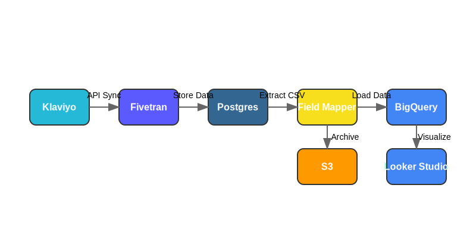

# Klaviyo Reporting POC Overview

## Introduction

The Klaviyo Reporting POC is a proof-of-concept implementation for automating Klaviyo reporting using Fivetran, BigQuery, and Looker Studio. This document provides a comprehensive overview of the architecture, components, and workflow of the POC.

## Architecture

The POC implements a data pipeline with the following components:

1. **Klaviyo**: Source of campaign, flow, and customer data
2. **Fivetran**: Data integration platform that syncs Klaviyo data to a Postgres database
3. **Postgres**: Intermediate database that stores the raw Klaviyo data
4. **ETL Runner**: Custom Python script that orchestrates the data extraction and transformation
5. **Field Mapper**: Custom Python script that normalizes Klaviyo fields for Looker Studio
6. **S3**: Cloud storage for archiving processed data
7. **BigQuery**: Data warehouse for analytics and reporting
8. **Looker Studio**: Visualization tool for creating dashboards and reports

## Data Flow



The data flows through the system as follows:

1. **Klaviyo → Fivetran**: Fivetran syncs Klaviyo data to a Postgres database
2. **Fivetran → Postgres**: Raw Klaviyo data is stored in Postgres tables
3. **Postgres → CSV**: Data is extracted from Postgres to CSV files
4. **CSV → Field Mapper**: CSV data is processed through the field mapper
5. **Field Mapper → Processed CSV**: Normalized data is saved as processed CSV files
6. **Processed CSV → S3**: Processed data is archived to S3 for long-term storage
7. **Processed CSV → BigQuery**: Processed data is loaded into BigQuery tables
8. **BigQuery → Looker Studio**: Looker Studio connects directly to BigQuery for visualization

## Components

### Fivetran API Client

The Fivetran API Client (`src/fivetran_api_client.py`) is a thin wrapper around the Fivetran REST API that provides functions for:

- Listing groups and connectors
- Triggering manual syncs
- Polling sync status until completion
- Handling rate limits with exponential backoff

### Connector Runner

The Connector Runner (`src/fivetran_connector_runner.py`) is a command-line tool that:

- Triggers a Fivetran sync for a specific connector
- Waits for the sync to complete
- Exits with a success or failure code

### Postgres Extract Export

The Postgres Extract Export (`src/postgres_extract_export.py`) is a command-line tool that:

- Connects to the Fivetran destination Postgres database
- Extracts data from specified tables
- Filters data by date range
- Exports data to CSV files

### ETL Runner

The ETL Runner (`src/etl_runner.py`) is a command-line tool that orchestrates the entire data pipeline:

- Triggers Fivetran syncs
- Extracts data from Postgres
- Processes data through the field mapper
- Uploads processed data to S3
- Loads data into BigQuery

### S3 Uploader

The S3 Uploader (`src/s3_uploader.py`) is a utility that:

- Uploads files to S3 buckets
- Handles retries with exponential backoff
- Sets appropriate metadata

### AWS SES Email Smoke Test

The AWS SES Email Smoke Test (`scripts/ses_smoketest.py`) is a utility that:

- Sends test emails via AWS SES
- Verifies that the email sending pipeline is working
- Provides a template for sending notifications

## Configuration

The POC is configured using environment variables, which can be set in a `.env` file or directly in the environment. The required environment variables are documented in the `.env.example` file.

## Usage

### Running the Full Pipeline

```bash
# Run the full ETL pipeline with Fivetran source
python src/etl_runner.py --source fivetran --start 2024-05-01 --end 2024-05-07

# Upload processed data to S3
python src/etl_runner.py --source fivetran --start 2024-05-01 --end 2024-05-07 --upload-s3 s3://bucket/prefix/
```

### Running Individual Components

```bash
# Trigger a Fivetran sync
python src/fivetran_connector_runner.py --group GROUP_ID --connector CONNECTOR_ID

# Extract data from Postgres
python src/postgres_extract_export.py --table klaviyo_campaigns --start 2024-05-01 --end 2024-05-07

# Send a test email
python scripts/ses_smoketest.py --to recipient@example.com --subject "Test Email" --body "This is a test email"
```

## Limitations and Future Work

### Current Limitations

- The POC currently only supports basic campaign metrics
- Limited error handling for API rate limits
- Requires Fivetran, Postgres, BigQuery, and AWS S3 accounts for full functionality

### Future Work

- Add support for more Klaviyo metrics and dimensions
- Implement more robust error handling and logging
- Add support for incremental loads
- Implement automated testing and CI/CD
- Add support for multiple Klaviyo accounts

## Conclusion

The Klaviyo Reporting POC demonstrates a scalable and robust approach to automating Klaviyo reporting using Fivetran, BigQuery, and Looker Studio. The architecture provides a solid foundation for building a production-ready reporting solution.
